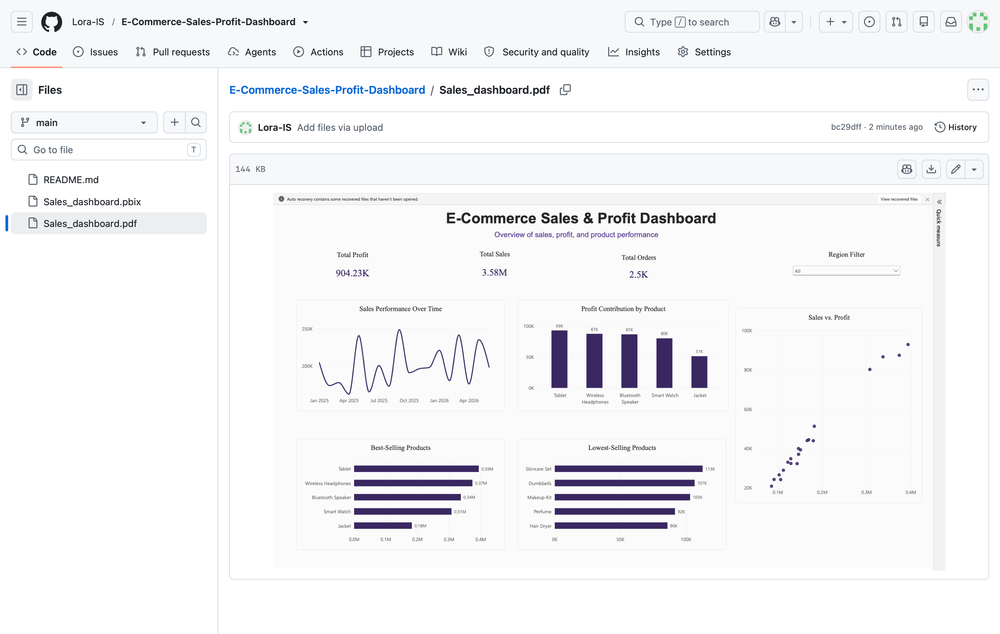

# E-Commerce Sales & Profit Dashboard

An interactive Power BI dashboard designed to analyze e-commerce sales, profit, orders, product performance, and sales trends over time.

## Dashboard Overview

The dashboard provides a clear overview of business performance through interactive KPIs and visualizations.

### Key Metrics
- Total Sales: 3.58M
- Total Profit: 904.23K
- Total Orders: 2.5K

### Key Insights
- Sales performance over time
- Profit contribution by product
- Best-selling products
- Lowest-selling products
- Relationship between sales and profit
- Sales performance by region

## Tools & Technologies

- Power BI
- Data Visualization
- Business Intelligence
- Data Analysis

## Dashboard Preview

## Files

- `Sales-dashboard.pbix` — Power BI dashboard file
- `Sales-dashboard.pdf` — PDF preview of the dashboard

## Purpose

This project was created to practice data analysis and business intelligence skills using Power BI, with a focus on transforming sales data into clear and actionable insights.

